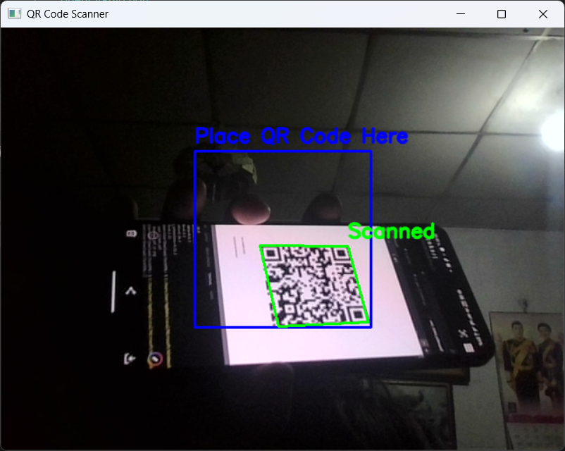
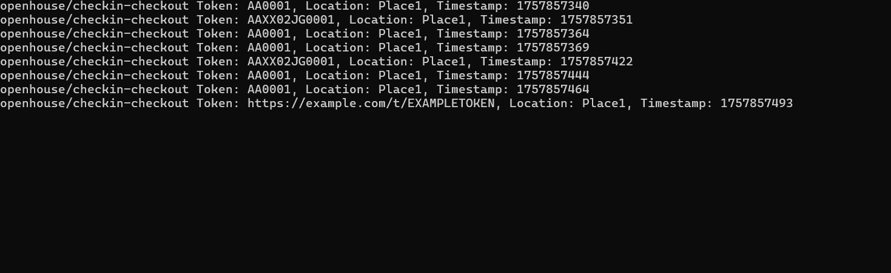
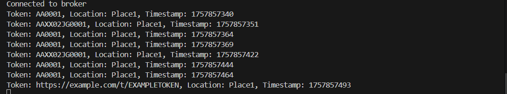
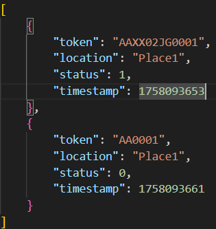

# QR Code Reader wiith MQTT server
This project tends to be a prototype of QR Code Reader module for Software Development Practice I
## Contents
1. [Installation](#installation)
2. [Running](#running)
3. [Footage](#footage)

## Installation
Follow these steps to set up the project environment.

### Prerequisites
* Python 3.8+ and `pip`
* Git
* Node.js

### Steps
1. Clone this repository.
```bash
git clone https://github.com/nemoirisgurl/QR-Code-Reader-with-MQTT.git
cd QR-Code-Reader-with-MQTT
```
2. Install and activate python virtual environment.
   * **Windows:**
```bash
python -m venv venv
.\venv\Scripts\activate
```
   * **MacOS/Linux:**
```bash
python3 -m venv venv
source venv/bin/activate
```

```bash
sudo apt install libzbar0
sudo apt install libzbar-dev
sudo apt install -y python3-evdev
```
```bash

sudo usermod -a -G dialout $USER
```

```bash
groups
sudo usermod -aG video $USER
newgrp video
ls -l /dev/video*
v4l2-ctl --all | head -n 20
```

```bash
sudo apt install -y python3-evdev
ls -l /dev/input/by-id/

sudo usermod -aG input $USER
newgrp input

sudo tee /etc/udev/rules.d/99-barcode-scanner.rules >/dev/null <<'EOF'
SUBSYSTEM=="input", ATTRS{idVendor}=="ac90", ATTRS{idProduct}=="3002", GROUP="input", MODE="0660"
EOF
sudo udevadm control --reload
sudo udevadm trigger

ls -l /dev/input/by-id/ | grep -i "HID_KBW\|SM-2D\|ac90"
```

3.  Install the required Python packages:
```bash
pip install -r requirements.txt
```

4. Run MQTT Broker:
```bash
node qrscan_pub.js
```

## Running
Use this command
```bash
python read_qrcode_module/read_qrcode_bcode.py
```
or
```bash
python read_qrcode_module/read_qrcode_webcam.py
```
Make sure you run the command on the **QR-Code-Reader-with-MQTT** folder and different terminal from MQTT Broker
## Footage

  

OpenCV QR Code Scanner 



Client result (Publish to broker)



Server result (Subscribe from client)



JSON File data
